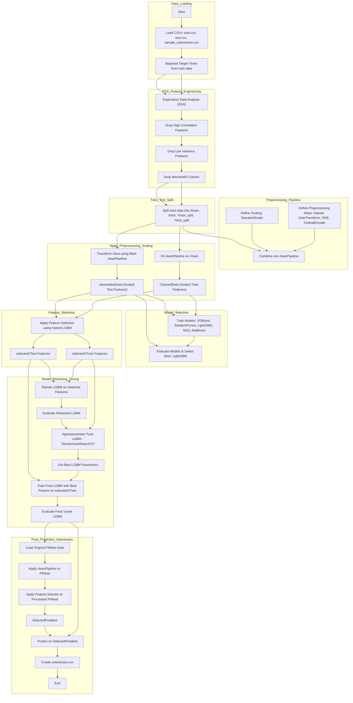

# System Threat Forecaster: My Malware Prediction Adventure! 🚀🦠💻

Hey Everyone! 👋 Welcome to my project where I tackled the challenge of predicting whether a Windows machine might get infected with malware. Think of it like a digital immune system check!

## The Mission 🎯

The goal was simple (well, kinda! 😉): Use a bunch of system data (telemetry) to predict if a machine (`target` = 1) had malware detected on it. The data came from antivirus threat reports.

## The Data Stash 💾🔍

*   **Source:** System Threat Forecaster (Kaggle-like dataset)
*   **What's inside:** Lots of details about different computers, identified by `MachineID`.
*   **Files:**
    *   `train.csv`: My training playground, full of features and the all-important `target` (0 or 1).
    *   `test.csv`: The mystery machines! Features provided, but I had to predict the `target`.
    *   `sample_submission.csv`: The format for my final predictions.

## My Project Journey: Step-by-Step! 🗺️

Here's how I went about building the predictor:

1.  **Loading Up 🔃:** First things first, I loaded up the `train`, `test`, and `sample_submission` files using Pandas. I immediately separated the `target` variable from the training set – gotta keep that safe!

2.  **Detective Work (EDA) 🕵️‍♂️🔬:** Time to put on my detective hat!
    *   Visualized feature distributions (like `PlatformType`).
    *   Checked the target balance – were there roughly equal numbers of infected (1) and clean (0) machines? Yep, pretty balanced! ✅
    *   Hunted down those pesky missing values (nulls) 📊 and saw which features needed some TLC later.
    *   Looked at how things like the number of antivirus products installed related to getting infected.

3.  **Feature Slimdown Time! 💪✂️:** Some features just weren't pulling their weight or were clones of others!
    *   Dropped features that were *super* similar (high correlation). 👋
    *   Dropped features that barely changed (low variance) – yawn! 😴 (Found 15 of these!).
    *   Got rid of `MachineID` – it's just an ID, doesn't help predict!

4.  **Splitting the Crew 🪓:** To properly test my models later, I split my *training* data into a new training set (`Xtrain`) and a validation set (`Xtest`) using `train_test_split`.

5.  **The Preprocessing Makeover 🤖🔧✨:** Data needs cleaning and standardizing! I built a `sklearn` Pipeline using `ColumnTransformer` to handle everything automatically:
    *   **Numbers 🔢:** Filled in missing values (`SimpleImputer`) and put them all on the same scale (`StandardScaler`).
    *   **Categories (Few Options) 🏷️:** Filled missings (`most_frequent`) and turned them into binary columns (`OneHotEncoder`). *Poof!* More columns, but the models understand them better.
    *   **Categories (Lots of Options) 🏷️:** Filled missings (`most_frequent`) and assigned numbers (`OrdinalEncoder`).
    *   **Dates 📅:** Created a cool custom function (`FunctionTransformer`) to pull out the month, day, year, and even the time difference between the OS install and the scan! Then filled any gaps.

6.  **The Model Gauntlet 🥊:** Which model would reign supreme? I trained and tested several contenders on my preprocessed data:
    *   XGBoost ⏩
    *   Random Forest 🌳
    *   LightGBM ⚡ (Spoiler: This one looked promising!)
    *   SGD Classifier 🗿
    *   AdaBoost 💣
    *   Evaluated them using accuracy and detailed reports on the validation set. LightGBM came out on top! 🏆

7.  **Picking the Feature All-Stars 🛍️:** With LightGBM crowned the champ, I used its feature importances (`SelectFromModel`) to pick the *most* valuable players. This trimmed the feature count way down (from 153 after OHE to 88) without hurting performance much! Efficiency! ✨

8.  **Tuning the Champion 🛠️⚙️:**
    *   Retrained LightGBM with just the selected features – still performed great!
    *   Used `RandomizedSearchCV` to hunt for the *absolute best* settings (hyperparameters) for LightGBM.
    *   Trained the final, tuned-up LightGBM model on the selected training features.

9.  **The Grand Finale! 🎉:** Time for the *real* test data!
    *   Applied the *entire fitted preprocessing pipeline* to the original `test.csv`.
    *   Applied the *fitted feature selector* to the processed test data.
    *   Used my final, tuned LightGBM model to make the predictions! 🔮
    *   Saved the results into `submission.csv`.

## The Workflow Map! 🗺️

